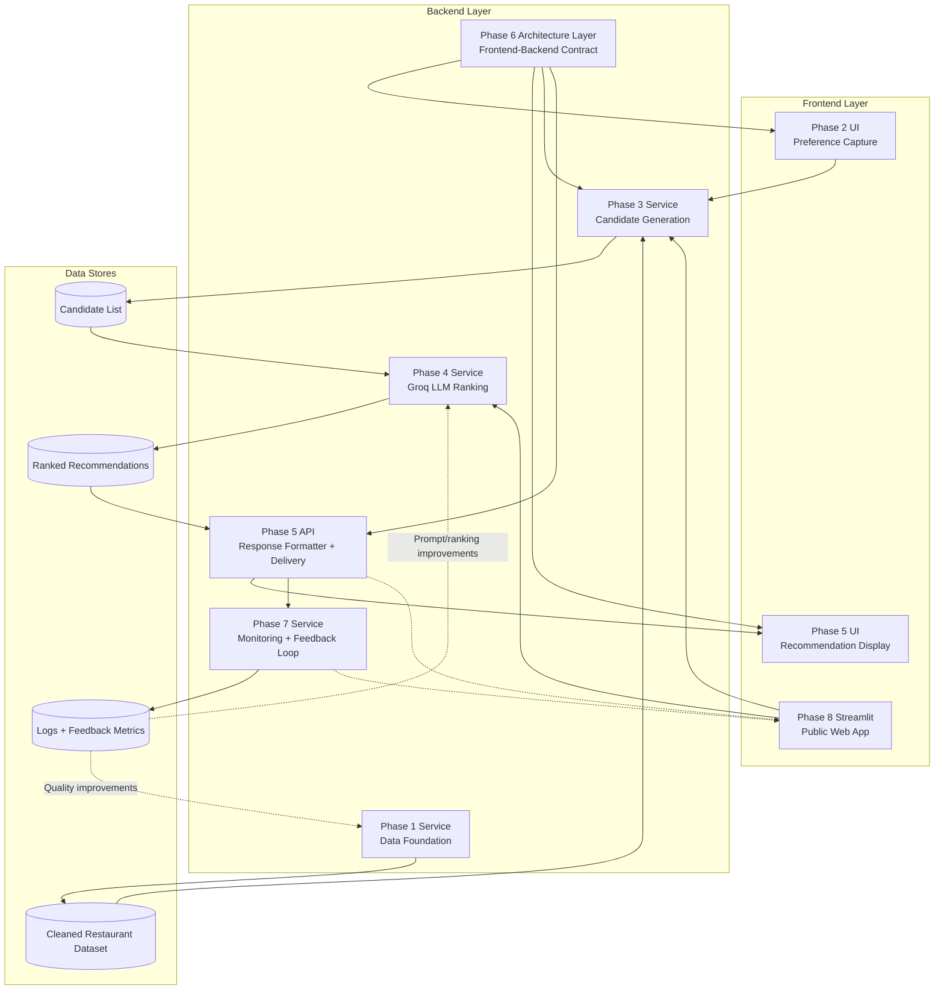

# Problem Statement: AI-Powered Restaurant Recommendation System (Zomato Use Case)

Build an AI-powered restaurant recommendation service inspired by Zomato. The system should intelligently suggest restaurants based on user preferences by combining structured restaurant data with a Large Language Model (LLM).

## Objective

Design and implement an application that:

- Accepts user preferences such as location, budget, cuisine, and ratings
- Uses a real-world restaurant dataset
- Leverages an LLM to generate personalized, human-like recommendations
- Presents clear, useful, and actionable results to the user

## System Workflow

### 1) Data Ingestion

- Load and preprocess the Zomato dataset from Hugging Face: https://huggingface.co/datasets/ManikaSaini/zomato-restaurant-recommendation
- Extract relevant fields such as:
  - Restaurant name
  - Location
  - Cuisine
  - Estimated cost
  - Rating

### 2) User Input

Collect user preferences, including:

- Location (for example: Delhi, Bangalore)
- Budget (low, medium, high)
- Cuisine (for example: Italian, Chinese)
- Minimum rating
- Additional preferences (for example: family-friendly, quick service)

### 3) Integration Layer

- Filter and prepare restaurant records based on user input
- Convert filtered records into structured context for the LLM
- Design a prompt that helps the LLM reason over and rank the options

### 4) Recommendation Engine

Use the LLM to:

- Rank restaurants by suitability
- Explain why each recommendation is a good fit
- Optionally provide a concise summary of top choices

### 5) Output Display

Present top recommendations in a user-friendly format, including:

- Restaurant name
- Cuisine
- Rating
- Estimated cost
- AI-generated explanation

## Phase-Wise Architecture

### Phase 1: Foundation and Data Preparation

**Goal:** Build a reliable data layer for downstream recommendation logic.

**Key Components:**

- **Dataset Loader:** Pulls restaurant data from Hugging Face
- **Data Preprocessing Pipeline:** Cleans missing values, normalizes formats, and standardizes fields
- **Feature Store (Structured Table):** Stores curated columns such as name, location, cuisine, cost, and rating
- **Basic Web UI (Input Source):** Captures user preferences through a simple form interface for downstream phases

**Inputs:** Raw Zomato dataset + user preferences from basic web UI  
**Outputs:** Cleaned and query-ready restaurant dataset  
**Success Criteria:** Data quality checks pass and required fields are consistently available

### Phase 2: User Preference Capture Layer

**Goal:** Collect and validate user constraints for personalized recommendations.

**Key Components:**

- **Input Interface:** Form/chat-based input collection
- **Validation Module:** Validates values such as budget range and minimum rating
- **Preference Normalizer:** Converts user choices into machine-friendly filters

**Inputs:** User-provided preferences  
**Outputs:** Normalized preference object (location, cuisine, budget, rating, additional tags)  
**Success Criteria:** Inputs are valid, complete, and ready for filtering

### Phase 3: Retrieval and Candidate Generation

**Goal:** Reduce search space to a relevant candidate pool.

**Key Components:**

- **Filter Engine:** Applies hard constraints (location, budget, minimum rating)
- **Candidate Selector:** Returns top matching restaurants for LLM reasoning
- **Fallback Handler:** Relaxes non-critical constraints if very few matches are found

**Inputs:** Clean dataset + normalized preferences  
**Outputs:** Candidate restaurant list  
**Success Criteria:** Candidate list is relevant, diverse, and non-empty in most scenarios

### Phase 4: LLM-Based Ranking and Explanation

**Goal:** Produce intelligent, explainable recommendations from the candidate set.

**Key Components:**

- **Prompt Builder:** Creates structured prompts with user preferences and candidate data
- **LLM Inference Module:** Ranks restaurants and generates human-like reasoning
- **Post-Processor:** Parses and formats LLM output into a stable schema

**Inputs:** Candidate list + user preferences  
**Outputs:** Ranked recommendations with explanations  
**Success Criteria:** Recommendations align with constraints and explanations are coherent

### Phase 5: Response Delivery and Presentation

**Goal:** Display final recommendations clearly and consistently.

**Key Components:**

- **Recommendation API:** Serves ranked results to frontend/UI
- **Presentation Layer:** Renders restaurant cards/table with summary fields
- **Response Formatter:** Ensures consistent output structure across requests

**Inputs:** Ranked recommendations from LLM layer  
**Outputs:** User-facing recommendation view  
**Success Criteria:** Fast response time and user-friendly display of results

### Phase 6: Updated Backend and Frontend Architecture

### Frontend Architecture

- **Phase 2 Web UI:** Captures user preferences (location, budget, cuisine, minimum rating, additional tags)
- **Phase 5 Presentation UI:** Displays ranked restaurant cards with cuisine, rating, estimated cost, and AI explanation
- **UI-to-API Contract:** Sends validated preference payloads and consumes formatted recommendation responses

### Backend Architecture

- **Phase 1 Data Foundation Service:** Loads dataset, preprocesses data, and produces cleaned restaurant feature store
- **Phase 3 Candidate Generation Service:** Applies constraint filtering and fallback relaxation to return top candidate pool
- **Phase 4 LLM Ranking Service (Groq):** Builds prompts, calls Groq model, validates/parses output, and produces ranked recommendations
- **Phase 5 Delivery API:** Enriches ranked results with candidate metadata and serves stable JSON response schema to frontend

### Data and Integration Flow

1. Frontend captures user preferences in Phase 2 UI.
2. Backend normalizes preferences and applies retrieval logic in Phase 3.
3. Candidate set is passed to Groq-based ranking in Phase 4.
4. Phase 5 API formats and serves final recommendations.
5. Frontend renders the final user-facing recommendation cards.

### Phase 7: Monitoring, Feedback, and Iteration

**Goal:** Improve recommendation quality over time.

**Key Components:**

- **Logging and Analytics:** Tracks requests, selected filters, and response quality signals
- **Feedback Collector:** Captures user ratings on recommendations
- **Evaluation Loop:** Measures precision, relevance, and explanation quality for iterative tuning

**Inputs:** Runtime logs + user feedback  
**Outputs:** Improvement backlog and model/prompt refinements  
**Success Criteria:** Measurable improvement in recommendation relevance and user satisfaction

### Phase 8: Deployment using Streamlit

**Goal:** Create a lightweight, shareable, and interactive web application for public use.

**Key Components:**

- **Streamlit App:** Wraps the entire workflow into a single-page interactive UI
- **Interactive Widgets:** Sidebar or main panel inputs for location, budget, cuisine, and rating
- **Live Inference:** Connects real-time inputs to the candidate generation and LLM ranking layers
- **Cloud Hosting:** Deploys the Streamlit app to Streamlit Cloud or a similar hosting service

**Inputs:** Backend services + user-provided inputs via Streamlit widgets  
**Outputs:** An accessible URL hosting the restaurant recommendation system  
**Success Criteria:** The app is publicly accessible and provides recommendations in real-time

## Simple Architecture Diagram

